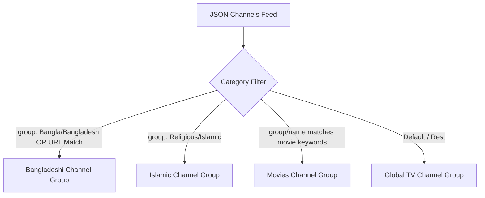
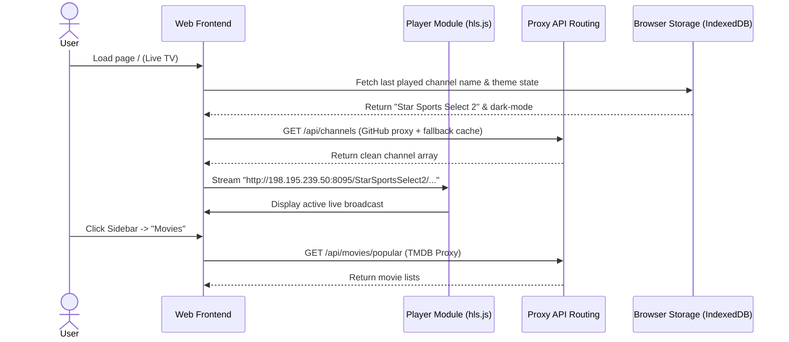

# Technical Blueprint: IPTV Web Application Migration

This blueprint provides a comprehensive architectural and engineering roadmap for migrating the existing `LiveTvBD` Android application to a high-performance, premium web application.

localhost credentials:
db:tv
user:root
pass:

use laravel and bootrap 5
---

## 1. Reverse-Engineering the Android Application

The existing Android app (`com.livetvbd.app`) is built on a standard MVVM (Model-View-ViewModel) architecture. Below is the breakdown of its structures, features, and source components.

### 1.1 Architecture & Package Layout
*   **Application Class**: [LiveTvApp.java](file:///c:/xampp/htdocs/LiveTvBD/app/src/main/java/com/livetvbd/app/LiveTvApp.java) initializes Firebase, Room Database, and the App Lifecycle configurations.
*   **Main Window**: [MainActivity.java](file:///c:/xampp/htdocs/LiveTvBD/app/src/main/java/com/livetvbd/app/MainActivity.java) implements a navigation drawer (`DrawerLayout` / `NavigationView`) controlling the active Fragment.
*   **Navigation Routing**: Managed by [nav_graph.xml](file:///c:/xampp/htdocs/LiveTvBD/app/src/main/res/navigation/nav_graph.xml), containing five main fragment targets:
    *   `nav_sports` (Start Destination): Map view containing the Live TV / Sports player dashboard.
    *   `nav_home`: Movie browsing dashboard separated by category chips.
    *   `nav_favorites`: Stub recommendation panel for TMDB categories.
    *   `nav_profile`: User information form and theme settings.
    *   `nav_search`: Dedicated query view for TMDB movies.

### 1.2 Existing Content Organization & Filtering Logic
Content categorization and stream mapping are handled programmatically within [MediaRepository.java](file:///c:/xampp/htdocs/LiveTvBD/app/src/main/java/com/livetvbd/app/data/repository/MediaRepository.java):



#### Content Filters & Categorization Rules:
*   **Bangladeshi**: Selected if group is `"Bangla"`/`"Bangladesh"`, or title/URL contains keywords like `tsports`, `somoy`, `btv`, `ekattor`, etc. Excludes foreign/Indian duplicate streams (e.g. `zee`, `star`, `jalsha`).
*   **Islamic**: Selected if group is `"Religious"`/`"Islamic"`. The app prioritizes `"WAZ TV"`, `"ISLAMIC TV"`, `"PEACE TV BANGLA"`, and `"QURAN TV"`.
*   **Movies**: Selected if group or title contains movie keywords (`"hbo"`, `"sony aath"`, `"cineedge"`, etc.). The app injects a static array of custom movie stream objects and skips `"movies now"`, `"sony pix"`, and `"cinemax"`.
*   **Global TV**: Catch-all for channels that do not fit into Bangladeshi, Islamic, or Movie categories. The app explicitly removes `"bbc"`, `"reuters"`, `"bloomberg"`, `"fox news"`, `"france 24"`, and `"euronews"`.

---

## 2. API Architecture & Endpoint Specifications

The app interacts with multiple REST APIs. Some are active production endpoints, while others are declared stubs.

### 2.1 The Movie Database (TMDB) API [Active]
*   **Purpose**: Supplies all movie and TV metadata, similar lists, search results, and trailers.
*   **Auth Method**: OAuth 2.0 Bearer Token in HTTP header (`Authorization: Bearer <TMDB_READ_TOKEN>`).
*   **Rate Limits**: TMDB enforces a standard rate limit of 40 requests per 10 seconds.
*   **JSON Response Objects**: Custom parser classes mapping posters and backdrops are written in [TmdbMovieDetail.java](file:///c:/xampp/htdocs/LiveTvBD/app/src/main/java/com/livetvbd/app/data/remote/TmdbMovieDetail.java) and [TmdbResponse.java](file:///c:/xampp/htdocs/LiveTvBD/app/src/main/java/com/livetvbd/app/data/remote/TmdbResponse.java).

| Endpoint | HTTP Method | Request Query / Params | Key JSON Response Fields |
| :--- | :---: | :--- | :--- |
| `/movie/popular` | `GET` | `page`, `language` | `results: Array<{ id, title, poster_path, backdrop_path, vote_average }>` |
| `/movie/top_rated` | `GET` | `page`, `language` | `results: Array<{ id, title, poster_path, backdrop_path, vote_average }>` |
| `/movie/now_playing` | `GET` | `page`, `language` | `results: Array<{ id, title, poster_path, backdrop_path, vote_average }>` |
| `/discover/movie` | `GET` | `with_genres`, `sort_by`, `page`, `language` | `results: Array<{ id, title, poster_path, vote_average }>` |
| `/search/movie` | `GET` | `query`, `page`, `language` | `results: Array<{ id, title, poster_path, vote_average }>` |
| `/movie/{movie_id}` | `GET` | `movie_id` (Path), `append_to_response="videos"` | `id, title, overview, release_date, runtime, genres, vote_average, videos: { results: Array<{ key, site, type }> }` |
| `/movie/{movie_id}/similar`| `GET`| `movie_id` (Path), `page`, `language` | `results: Array<{ id, title, poster_path }>` |

### 2.2 IPTV Stream JSON Feed [Active]
*   **Endpoint**: `https://raw.githubusercontent.com/foridul422/IPTV-/main/channels.json`
*   **Purpose**: Raw listing of live television and sports channels.
*   **Auth**: None (Public Raw GitHub Feed).
*   **Request Format**: Standard HTTP GET.
*   **Response Structure (JSON Array)**:
```json
[
  {
    "name": "T Sports HD",
    "logo": "https://...",
    "group": "Sports",
    "url": "http://198.195.239.50:8095/Tsports/index.m3u8"
  }
]
```

### 2.3 Stubs & Placeholders (Declared in Client but Inactive)
The following Retrofit interfaces exist in the Android client codebase, but their implementations are not integrated into current user views:
1.  **Supabase Client (`SupabaseApi`)**: Contains endpoints for `GET /favorites` and `POST /favorites`. Intended for storing favorite channels in a cloud PostgreSQL DB.
2.  **OpenSubtitle API (`OpenSubtitleApi`)**: Points to `https://opensubtitle.p.rapidapi.com/` for search/download.
3.  **IMDB8 API (`Imdb8Api`)**: Points to `https://imdb8.p.rapidapi.com/` (popular titles and company credits).
4.  **IMDB Top 1000 (`ImdbTopApi`)**: Points to `https://imdb-top-1000-movies-series.p.rapidapi.com/byrating`.
5.  **Streaming Availability (`StreamingAvailabilityApi`)**: Points to `https://streaming-availability.p.rapidapi.com/shows/{type}/{id}`.
6.  **Sofascore API (`SofascoreApi`)**: Points to `https://sofascore.p.rapidapi.com/` (live sports fixtures and match lists).

---

## 3. Migration Plan: Android to Web

The target web application will be built using a modern Single Page Application (SPA) architecture.

### 3.1 Sitemap
```
/ (Start Destination - Live TV Player)
├── /global-tv (Live TV Player with Global Category Selected)
├── /movies-channel (Live TV Player with Movies Category Selected)
├── /movies (TMDB movie explorer with Genre Chips)
│   └── /movies/[id] (Movie Details page with YouTube trailer and suggestions)
├── /favorites (TMDB Category Recommendations / Cloud Favorites)
├── /search (Debounced query interface)
├── /profile (User profile preferences / local history)
└── /dev-info (Redirects to https://engr-saad.com/)
```

### 3.2 User Navigation & Interaction Flow


### 3.3 Database & Local Storage Schema Shift
We will map the Android Room SQLite databases and SharedPreferences metadata to standard browser storage constructs (`localStorage` and `IndexedDB`):

```
┌─────────────────────────────────────────────────────────────┐
│                      BROWSER STORAGE                        │
├──────────────────────────────┬──────────────────────────────┤
│        localStorage          │          IndexedDB           │
├──────────────────────────────┼──────────────────────────────┤
│ • dark_mode: boolean         │ • favorites: Table           │
│ • user_name: string          │   - id (key)                 │
│ • user_phone: string         │   - title, posterUrl, type   │
│ • last_watched_channel: str  │ • watch_history: Table       │
│                              │   - id, title, progressMs,   │
│                              │     durationMs, posterUrl    │
└──────────────────────────────┴──────────────────────────────┘
```

---

## 4. Premium Architecture & UI Specs

To wow the user, the web application must implement premium dark-mode styles, responsive sidebars, glassmorphic layout wrappers, and robust HLS playback hooks.

### 4.1 Recommended Technology Stack
*   **Framework**: Next.js (React) or Vite (React SPA). Next.js is recommended for server-side API proxy routing, which hides API keys, and automated SEO static rendering.
*   **Language**: TypeScript for strict schema compilation.
*   **Styling**: Pure Vanilla CSS or CSS Modules utilizing CSS custom properties for modern glassmorphism.
*   **HLS Video Player**: `video.js` or standard HTML5 video elements powered by `hls.js` for custom playback layouts, wake lock controls, and stream recover logs.

### 4.2 Folder Structure (Vite / Next.js Clean Layout)
```
/
├── public/
│   ├── manifest.json         # PWA Manifest
│   ├── sw.js                 # PWA Service Worker
│   └── icons/                # High-res icons
├── src/
│   ├── assets/
│   │   └── global.css        # Theme variables, glassmorphic design tokens
│   ├── components/
│   │   ├── Sidebar.tsx       # Glass navigation panel
│   │   ├── VideoPlayer.tsx   # Custom hls.js wrapper
│   │   ├── Shimmer.tsx       # Skeleton loaders
│   │   └── MovieCard.tsx     # Reusable premium media item card
│   ├── hooks/
│   │   ├── useLocalStorage.ts
│   │   └── useWakeLock.ts    # Keeps screen active during streaming
│   ├── services/
│   │   ├── tmdb.ts           # TMDB HTTP fetcher
│   │   └── channels.ts       # GitHub live channel parser & logo mapper
│   └── pages/                # Vite Routes or Next.js Route directory
```

### 4.3 Clean Design System CSS Code
To replace basic Android layouts with a premium web experience, implement these core styling rules inside `src/assets/global.css`:

```css
:root {
  --font-family: 'Outfit', 'Inter', sans-serif;
  --bg-main: #0B0C10;
  --bg-card: rgba(31, 40, 51, 0.45);
  --border-glass: rgba(255, 255, 255, 0.08);
  --accent-gold: #C5A059;
  --text-primary: #FFFFFF;
  --text-secondary: #C5C6C7;
  --glow-color: rgba(197, 160, 89, 0.45);
}

body {
  margin: 0;
  font-family: var(--font-family);
  background-color: var(--bg-main);
  color: var(--text-primary);
  overflow-x: hidden;
}

/* Glassmorphism Wrapper Card */
.glass-panel {
  background: var(--bg-card);
  backdrop-filter: blur(16px) saturate(120%);
  border: 1px solid var(--border-glass);
  border-radius: 16px;
  box-shadow: 0 8px 32px 0 rgba(0, 0, 0, 0.3);
  transition: all 0.3s cubic-bezier(0.25, 0.8, 0.25, 1);
}

.glass-panel:hover {
  border-color: rgba(197, 160, 89, 0.3);
  box-shadow: 0 12px 40px 0 var(--glow-color);
  transform: translateY(-2px);
}

/* Custom HLS Video Container aspect-ratio */
.video-responsive-wrapper {
  position: relative;
  width: 100%;
  aspect-ratio: 16 / 9;
  border-radius: 12px;
  overflow: hidden;
  border: 1px solid var(--border-glass);
  box-shadow: 0 4px 20px rgba(0,0,0,0.5);
}
```

---

## 5. Optimization & Performance Strategies

### 5.1 Streaming Optimizations (HLS Settings)
HLS stream rendering in mobile browsers requires configuration overrides in `hls.js` to ensure fast initialization and robust error recovery:

```typescript
import Hls from 'hls.js';

export const configureHls = (videoElement: HTMLVideoElement, streamUrl: string) => {
  if (Hls.isSupported()) {
    const hls = new Hls({
      enableWorker: true,
      lowLatencyMode: true,
      maxBufferLength: 30, // Max buffered seconds
      maxBufferSize: 60 * 1000 * 1000, // 60MB max storage
      liveBackBufferLength: 10,
      fragLoadPolicy: {
        default: {
          maxTimeToFirstByteMs: 10000,
          maxLoadTimeMs: 20000,
          timeoutRetry: { maxNumRetry: 4, retryDelayMs: 1000, maxRetryDelayMs: 8000 },
          errorRetry: { maxNumRetry: 3, retryDelayMs: 2000, maxRetryDelayMs: 8000 }
        }
      }
    });

    hls.loadSource(streamUrl);
    hls.attachMedia(videoElement);

    hls.on(Hls.Events.ERROR, (event, data) => {
      if (data.fatal) {
        switch (data.type) {
          case Hls.ErrorTypes.NETWORK_ERROR:
            console.warn("HLS network error, recovering stream...");
            hls.startLoad();
            break;
          case Hls.ErrorTypes.MEDIA_ERROR:
            console.warn("HLS media error, attempting recovery...");
            hls.recoverMediaError();
            break;
          default:
            console.error("HLS unrecoverable playback error:", data);
            hls.destroy();
            break;
        }
      }
    });
    return hls;
  } else if (videoElement.canPlayType('application/vnd.apple.mpegurl')) {
    // Safari fallback
    videoElement.src = streamUrl;
  }
};
```

### 5.2 Progressive Web App (PWA) Implementation
Create the standard manifest schema `public/manifest.json` to allow users to add the application to their home screen:

```json
{
  "short_name": "LiveTV BD",
  "name": "Live TV and Movie Portal BD",
  "icons": [
    {
      "src": "/icons/icon-192.png",
      "type": "image/png",
      "sizes": "192x192"
    },
    {
      "src": "/icons/icon-512.png",
      "type": "image/png",
      "sizes": "512x512"
    }
  ],
  "start_url": "/",
  "background_color": "#0B0C10",
  "theme_color": "#0B0C10",
  "display": "standalone",
  "orientation": "any"
}
```

Implement standard **Stale-While-Revalidate** rules in `public/sw.js` for caching local UI pages, channel list JSON arrays, and TMDB layouts while bypassing video fragment payloads (`.ts`, `.m3u8` chunks) to prevent local cache overflow:

```javascript
const CACHE_NAME = 'livetv-bd-static-v1';
const STATIC_ASSETS = [
  '/',
  '/index.html',
  '/manifest.json',
  '/assets/global.css',
  '/icons/icon-192.png'
];

self.addEventListener('install', (e) => {
  e.waitUntil(caches.open(CACHE_NAME).then(cache => cache.addAll(STATIC_ASSETS)));
});

self.addEventListener('fetch', (e) => {
  const url = new URL(e.request.url);
  // Never cache live HLS stream fragments
  if (url.pathname.endsWith('.m3u8') || url.pathname.endsWith('.ts')) {
    return e.respondWith(fetch(e.request));
  }

  e.respondWith(
    caches.match(e.request).then((cachedResponse) => {
      const fetchPromise = fetch(e.request).then((networkResponse) => {
        if (networkResponse.status === 200) {
          caches.open(CACHE_NAME).then(cache => cache.put(e.request, networkResponse.clone()));
        }
        return networkResponse;
      });
      return cachedResponse || fetchPromise;
    })
  );
});
```

### 5.3 CDN & Image Optimizations
*   **CDN Selection**: Deploy the frontend to Vercel, Netlify, or Cloudflare Pages. This distributes JS bundles across multiple edge nodes, ensuring low latencies for users in Bangladesh and neighboring countries.
*   **TMDB Images**: Serve sizes corresponding to device screens (`w342` for mobile grids, `w780` for backdrop previews) rather than the raw `original` parameters.
*   **Lazy Loading**: Enable standard `loading="lazy"` tags on all images located below the fold.

---

## 6. Copy-Pasteable TypeScript Services (Centralized APIs)

This API Service module translates the original Kotlin categorizations and logo mappings into JavaScript.

### 6.1 Channel Feed Parser (`src/services/channels.ts`)
```typescript
export interface IptvChannel {
  name: string;
  logo: string;
  group: string;
  url: string;
  type?: string;
  rating?: number;
}

const DEFAULT_FALLBACK_LOGO = "https://tstatic.akash-go.com/cms-ui/images/custom-content/1770377900139.png";

// Direct translations of resolveLogoByName from MediaRepository.java
export const resolveLogoByName = (name: string): string => {
  if (!name) return DEFAULT_FALLBACK_LOGO;
  const n = name.toUpperCase().trim();
  if (n.includes("TSPORTS") || n.includes("T SPORTS")) {
    return "https://s3.aynaott.com/storage/dbc585f70a60b9855b6e13a8ce4cb6f4";
  }
  if (n.includes("STAR SPORTS SELECT 1") || n.includes("STAR SPORTS SELECT1")) {
    return "https://raw.githubusercontent.com/subirkumarpaul/Logo/main/Star%20Sports%20Select%201%40.jpeg";
  }
  if (n.includes("STAR SPORTS SELECT 2") || n.includes("STAR SPORTS SELECT2")) {
    return "https://raw.githubusercontent.com/subirkumarpaul/Logo/main/Star%20Sports%20Select%202.png";
  }
  if (n.includes("STAR SPORTS 1") || n.includes("STAR SPORTS1")) {
    return "https://raw.githubusercontent.com/subirkumarpaul/Logo/main/Star%20Sports%201.png";
  }
  if (n.includes("STAR SPORTS 2") || n.includes("STAR SPORTS2")) {
    return "https://raw.githubusercontent.com/subirkumarpaul/Logo/main/Star%20Sports%202.png";
  }
  if (n.includes("STAR PLUS")) {
    return "https://raw.githubusercontent.com/subirkumarpaul/Logo/main/Star%20Plus.png";
  }
  if (n.includes("STAR GOLD")) {
    return "https://raw.githubusercontent.com/subirkumarpaul/Logo/main/Star%20Gold.png";
  }
  if (n.includes("STAR MOVIES")) {
    return "https://raw.githubusercontent.com/subirkumarpaul/Logo/main/Star%20Movies.png";
  }
  if (n.includes("SONY SPORTS 2") || n.includes("SONY TEN SPORTS 2") || n.includes("SONY TEN 2")) {
    return "https://raw.githubusercontent.com/subirkumarpaul/Logo/main/Sony%20Sports%20Ten%202.png";
  }
  if (n.includes("SONY SPORTS 5") || n.includes("SONY TEN SPORTS 5") || n.includes("SONY TEN 5")) {
    return "https://raw.githubusercontent.com/subirkumarpaul/Logo/main/Sony%20Sports%20Ten%205.png";
  }
  if (n.includes("SONY TV")) {
    return "https://raw.githubusercontent.com/subirkumarpaul/Logo/main/Sony%20Tv.png";
  }
  if (n.includes("SONY MAX")) {
    return "https://raw.githubusercontent.com/subirkumarpaul/Logo/main/Sony%20Max.png";
  }
  if (n.includes("SONY AATH")) {
    return "https://raw.githubusercontent.com/subirkumarpaul/Logo/main/Sony%20Aath.jpeg";
  }
  if (n.includes("EURO SPORTS") || n.includes("EUROSPORT")) {
    return "https://raw.githubusercontent.com/subirkumarpaul/Logo/main/Eurosport.png";
  }
  if (n.includes("JALSHA MOVIES")) {
    return "https://raw.githubusercontent.com/subirkumarpaul/Logo/main/Jalshamovieshd.jpg";
  }
  if (n.includes("HBO")) {
    // Web version: use local fallback png or web path instead of android.resource://
    return "/images/hbo.png";
  }
  if (n.includes("ZEE BANGLA CINEMA") || n.includes("ZEE BANGLA CHINEMA")) {
    return "https://raw.githubusercontent.com/subirkumarpaul/Logo/main/Zee%20Bangla%20Cinema.png";
  }
  if (n.includes("ZEE TV")) {
    return "https://raw.githubusercontent.com/subirkumarpaul/Logo/main/Zee%20TV.png";
  }
  if (n.includes("DISCOVERY KIDS")) {
    return "https://raw.githubusercontent.com/subirkumarpaul/Logo/main/Discovery%20Kids.png";
  }
  if (n.includes("DISCOVERY")) {
    return "https://raw.githubusercontent.com/subirkumarpaul/Logo/main/Discovery.png";
  }
  if (n.includes("NATIONAL GEOGRAPHIC")) {
    return "https://raw.githubusercontent.com/subirkumarpaul/Logo/main/National%20Geographic.png";
  }
  if (n.includes("CARTOON NETWORK")) {
    return "https://raw.githubusercontent.com/subirkumarpaul/Logo/main/Cartoon%20Network.png";
  }
  if (n.includes("NAGORIK")) {
    return "https://upload.wikimedia.org/wikipedia/commons/e/e0/Nagorik_TV_logo.png";
  }
  if (n.includes("NEWS 24") || n.includes("NEWS24")) {
    return "https://upload.wikimedia.org/wikipedia/commons/7/77/News24_logo.png";
  }
  if (n.includes("COLORS BANGLA") || n.includes("COLOR BANGLA")) {
    return "https://upload.wikimedia.org/wikipedia/commons/6/6f/Colors_Bangla_logo.png";
  }
  if (n.includes("SKY SPORT")) {
    return "https://raw.githubusercontent.com/subirkumarpaul/Logo/main/Sky%20Sports.png";
  }
  return DEFAULT_FALLBACK_LOGO;
};

// Static custom data definitions
export const getCustomMovieChannels = (): IptvChannel[] => [
  { name: "Star Movies", logo: "https://raw.githubusercontent.com/subirkumarpaul/Logo/main/Star%20Movies.png", url: "http://198.195.239.50:8095/StarMovies/index.m3u8", group: "Movies" },
  { name: "Cineedge HD", logo: "https://tstatic.akash-go.com/cms-ui/images/custom-content/1770347851305.png", url: "https://nomawnoijl.gpcdn.net/akash/cineedge/playlist.m3u8", group: "Movies" },
  { name: "Uniques HD", logo: "https://tstatic.akash-go.com/cms-ui/images/custom-content/1770347327658.png", url: "https://nomawnoijl.gpcdn.net/akash/uniques/playlist.m3u8", group: "Movies" },
  { name: "Superrix HD", logo: "https://tstatic.akash-go.com/cms-ui/images/custom-content/1770348388925.png", url: "https://nomawnoijl.gpcdn.net/akash/superrix/playlist.m3u8", group: "Movies" },
  { name: "Screem", logo: "https://tstatic.akash-go.com/cms-ui/images/custom-content/1770312098339.png", url: "https://nomawnoijl.gpcdn.net/akash/screem/playlist.m3u8", group: "Movies" },
  { name: "Crimes", logo: "https://tstatic.akash-go.com/cms-ui/images/custom-content/1770380126540.png", url: "https://nomawnoijl.gpcdn.net/akash/crimes/playlist.m3u8", group: "Movies" },
  { name: "True Stories", logo: "https://tstatic.akash-go.com/cms-ui/images/custom-content/1770380306806.png", url: "https://nomawnoijl.gpcdn.net/akash/truestories/playlist.m3u8", group: "Movies" },
  { name: "Intelligence", logo: "https://tstatic.akash-go.com/cms-ui/images/custom-content/1770380460488.png", url: "https://nomawnoijl.gpcdn.net/akash/intelligence/playlist.m3u8", group: "Movies" },
  { name: "Originals", logo: "https://tstatic.akash-go.com/cms-ui/images/custom-content/1778085327477.png", url: "https://nomawnoijl.gpcdn.net/akash/originals/playlist.m3u8", group: "Movies" },
  { name: "Hindi Movie Classic 24", logo: "https://s3.aynaott.com/storage/3132515182ec50091b496fe515564084", url: "https://vods2.aynaott.com/hindimovies/index.m3u8", group: "Movies" },
  { name: "Action Hollywood Movies", logo: "https://raw.githubusercontent.com/subirkumarpaul/Logo/main/Star%20Movies.png", url: "https://amg01076-lightningintern-actionhollywood-samsungnz-82rry.amagi.tv/playlist/amg01076-lightningintern-actionhollywood-samsungnz/playlist.m3u8", group: "Movies" }
];

export const getFifaSportsChannels = (): IptvChannel[] => [
  { name: "T Sports HD", logo: "https://s3.aynaott.com/storage/dbc585f70a60b9855b6e13a8ce4cb6f4", url: "http://198.195.239.50:8095/Tsports/index.m3u8", group: "Sports" },
  { name: "B TV", logo: "https://s3.aynaott.com/storage/00da8a07fb26b2fb79359ee535e4c7bc", url: "https://tvsen6.aynaott.com/btvctg/index.m3u8?e=1779283747&u=78be6644-0a65-48ec-81a4-089ac65a2619&token=9bca925fbdfe526b29d41ab7802348ec", group: "Sports" },
  { name: "Somoy TV", logo: "https://s3.aynaott.com/storage/ece71c1163a377fbe2d93f9d28c34f60", url: "https://tvsen6.aynaott.com/somoytv/index.m3u8?e=1779283766&u=78be6644-0a65-48ec-81a4-089ac65a2619&token=269246b8a31fb3a656624d71e10e447d", group: "Sports" },
  { name: "beIN Sports", logo: "https://raw.githubusercontent.com/subirkumarpaul/Logo/main/Bein%20Sports%201.jpeg", url: "http://145.239.5.177:80/559/index.m3u8", group: "Sports" },
  { name: "ESPN", logo: "https://raw.githubusercontent.com/subirkumarpaul/Logo/main/ESPN.png", url: "https://tvsen5.aynaott.com/espn/index.m3u8?e=1779283793&u=78be6644-0a65-48ec-81a4-089ac65a2619&token=cf2b4cb8b6c96ab86daee4299c792295", group: "Sports" },
  { name: "Fox Sports", logo: "https://s3.aynaott.com/storage/da4282cd107cc3d40efadae488b187e5", url: "https://tvsen7.aynaott.com/foxsports2/index.m3u8?e=1779283790&u=78be6644-0a65-48ec-81a4-089ac65a2619&token=cbb7f40b4af7be51a91e0629a5ac7238", group: "Sports" },
  { name: "Canal+ Sport", logo: "https://upload.wikimedia.org/wikipedia/commons/1/1a/Canal%2B_Sport_2015.png", url: "http://151.80.18.177:86/Canal+_sport_HD/index.m3u8", group: "Sports" },
  { name: "Sports Legends", logo: "https://tstatic.akash-go.com/cms-ui/images/custom-content/1770377900139.png", url: "https://nomawnoijl.gpcdn.net/akash/sportslegends/playlist.m3u8", group: "Sports" },
  { name: "Flash Guys HD", logo: "https://tstatic.akash-go.com/cms-ui/images/custom-content/1770378074527.png", url: "https://nomawnoijl.gpcdn.net/akash/flashguys/playlist.m3u8", group: "Sports" },
  { name: "Sports Range", logo: "https://tstatic.akash-go.com/cms-ui/images/custom-content/1770380601958.png", url: "https://nomawnoijl.gpcdn.net/akash/sportrange/playlist.m3u8", group: "Sports" },
  { name: "Thunder Er", logo: "https://tstatic.akash-go.com/cms-ui/images/custom-content/1770380791303.png", url: "https://nomawnoijl.gpcdn.net/akash/thunder/playlist.m3u8", group: "Sports" },
  { name: "Fighters", logo: "https://tstatic.akash-go.com/cms-ui/images/custom-content/1770380942670.png", url: "https://nomawnoijl.gpcdn.net/akash/fighter/playlist.m3u8", group: "Sports" },
  { name: "Crazy Ex", logo: "https://tstatic.akash-go.com/cms-ui/images/custom-content/1778085745609.png", url: "https://nomawnoijl.gpcdn.net/akash/crazy_ex/playlist.m3u8", group: "Sports" },
  { name: "PTV Sports", logo: "https://s3.aynaott.com/storage/9d9d7cbfba5a8ceea648bbd963ad1014", url: "https://tvsen5.aynaott.com/PtvSports/index.m3u8?e=1780662761&u=78be6644-0a65-48ec-81a4-089ac65a2619&token=b714d4f0812496defe4be81125c560aa", group: "Sports" },
  { name: "A sports", logo: "https://s3.aynaott.com/storage/64de30d2df9b2a888cb73f17614a9a8b", url: "https://tvsen6.aynaott.com/asports/index.m3u8?e=1780662762&u=78be6644-0a65-48ec-81a4-089ac65a2619&token=79cb2b10ec3a06c91dc483a6f1a04f36", group: "Sports" },
  { name: "Cricket Gold", logo: "https://s3.aynaott.com/storage/7d20b575edc4e4b5276faa8c246e72a4", url: "https://tvsen6.aynaott.com/CricketGold/index.m3u8?e=1780662762&u=78be6644-0a65-48ec-81a4-089ac65a2619&token=c1ffa5e779430e350c5cc5401c9b9bdc", group: "Sports" },
  { name: "Willow TV", logo: "https://s3.aynaott.com/storage/94a778ec3219f7eb54bdf1ee07a95788", url: "https://tvsen5.aynaott.com/willowhd/index.m3u8?e=1780662762&u=78be6644-0a65-48ec-81a4-089ac65a2619&token=7ff3de9f9a286f0a6df46787e8abd8fb", group: "Sports" },
  { name: "DD Sports", logo: "https://s3.aynaott.com/storage/188500190395c4de0e506d518925dcc4", url: "https://cdn-6.pishow.tv/live/13/master.m3u8", group: "Sports" },
  { name: "STAR SPORTS 1", logo: "https://raw.githubusercontent.com/subirkumarpaul/Logo/main/Star%20Sports%201.png", url: "https://starsportshindiii.pages.dev/720p.m3u8", group: "Sports" },
  { name: "STAR SPORTS SELECT 1", logo: "https://raw.githubusercontent.com/subirkumarpaul/Logo/main/Star%20Sports%20Select%201%40.jpeg", url: "http://198.195.239.50:8095/StarSportsSelect1/tracks-v1a1/mono.m3u8", group: "Sports" },
  { name: "STAR SPORTS SELECT 2", logo: "https://raw.githubusercontent.com/subirkumarpaul/Logo/main/Star%20Sports%20Select%202.png", url: "http://198.195.239.50:8095/StarSportsSelect2/tracks-v1a1/mono.m3u8", group: "Sports" },
  { name: "EURO SPORTS", logo: "https://raw.githubusercontent.com/subirkumarpaul/Logo/main/Eurosport.png", url: "http://198.195.239.50:8095/Eurosport/index.m3u8", group: "Sports" },
  { name: "SONY TEN SPORTS 2", logo: "https://raw.githubusercontent.com/subirkumarpaul/Logo/main/Sony%20Sports%20Ten%202.png", url: "http://198.195.239.50:8095/SonyTenSports2/index.m3u8", group: "Sports" },
  { name: "SONY TEN SPORTS 5", logo: "https://raw.githubusercontent.com/subirkumarpaul/Logo/main/Sony%20Sports%20Ten%205.png", url: "http://198.195.239.50:8095/SonyTenSports5/index.m3u8", group: "Sports" },
  { name: "WILLOW SPORTS", logo: "https://raw.githubusercontent.com/subirkumarpaul/Logo/main/Willow%20TV.jpeg", url: "https://tvsen5.aynaott.com/willowhd/tracks-v1a1/mono.ts.m3u8", group: "Sports" }
];
```

### 6.2 Filter Layer (`src/services/filters.ts`)
```typescript
import { IptvChannel, getCustomMovieChannels, resolveLogoByName } from './channels';

export const fetchAndFilterIptv = async (category: string): Promise<IptvChannel[]> => {
  try {
    const res = await fetch("https://raw.githubusercontent.com/foridul422/IPTV-/main/channels.json");
    if (!res.ok) throw new Error("Network status invalid");
    const rawChannels: IptvChannel[] = await res.json();

    const all: IptvChannel[] = [];
    all.push(...getCustomMovieChannels());

    for (const c of rawChannels) {
      if (!c.name || !c.url || !c.url.startsWith("http")) continue;
      
      let logo = resolveLogoByName(c.name);
      if (logo === "https://tstatic.akash-go.com/cms-ui/images/custom-content/1770377900139.png") {
        if (c.logo && c.logo.startsWith("http")) logo = c.logo;
      }
      all.push({
        name: c.name,
        logo: logo,
        group: c.group || "Sports",
        url: c.url
      });
    }

    return filterByCategory(all, category);
  } catch (err) {
    console.error("IPTV fetch failed, fallback to offline stubs.", err);
    return [];
  }
};

const filterByCategory = (channels: IptvChannel[], category: string): IptvChannel[] => {
  return channels.filter((item) => {
    const nameLower = item.name.toLowerCase();
    
    // Explicit global exclusions
    if (nameLower.includes("bein sports") || 
        nameLower.includes("sky sports") || 
        nameLower.includes("tnt sports") || 
        nameLower.includes("espn") || 
        nameLower.includes("fox sports") || 
        nameLower.includes("supersport")) {
      return false;
    }

    if (category === "all") return true;

    const group = item.group || "";
    const groupLower = group.toLowerCase();
    const urlLower = item.url.toLowerCase();

    const isIslamic = groupLower.includes("religious") || groupLower.includes("islamic");
    const isMovie = groupLower.includes("movie") || 
                    groupLower.includes("cinema") || 
                    groupLower.includes("film") || 
                    nameLower.includes("movie") || 
                    nameLower.includes("cinema") || 
                    nameLower.includes("film") || 
                    nameLower.includes("hbo") || 
                    nameLower.includes("cinemax") || 
                    nameLower.includes("sony pix") || 
                    nameLower.includes("movies now") || 
                    nameLower.includes("cineedge") || 
                    nameLower.includes("uniques") || 
                    nameLower.includes("superrix") || 
                    nameLower.includes("screem") || 
                    nameLower.includes("crimes") || 
                    nameLower.includes("true stories") || 
                    nameLower.includes("intelligence") || 
                    nameLower.includes("originals") ||
                    nameLower.includes("sony aath");

    // Bangladeshi logic
    let isBd = groupLower.includes("bangla") || groupLower.includes("bangladesh");
    if (!isBd) {
      if (nameLower.includes("bangla") || nameLower.includes(" bd") || nameLower.includes("bd ") || nameLower.includes("dhaka") || nameLower.endsWith(" bd") ||
          urlLower.includes("tsports") || urlLower.includes("somoy") || urlLower.includes("btv") || 
          urlLower.includes("ekattor") || urlLower.includes("jamuna") || urlLower.includes("dbc") || 
          urlLower.includes("ekhon") || urlLower.includes("news24") || urlLower.includes("atn") || 
          urlLower.includes("rtv") || urlLower.includes("channeli") || urlLower.includes("channel9") || 
          urlLower.includes("boishakhi") || urlLower.includes("desh") || urlLower.includes("anandatv") || 
          urlLower.includes("satv") || urlLower.includes("etv") || 
          urlLower.includes("mytv") || urlLower.includes("mohona") || 
          urlLower.includes("maasranga") || urlLower.includes("nexus") || urlLower.includes("asian") || 
          urlLower.includes("ntv") || urlLower.includes("gazi") || urlLower.includes("banglavision")) {
        isBd = true;
      }
    }

    if (isBd) {
      if (nameLower.includes("republic") || nameLower.includes("sangeet") || nameLower.includes("dd bangla") || 
          nameLower.includes("enter 10") || nameLower.includes("khushboo") || nameLower.includes("colors") || 
          nameLower.includes("zee") || nameLower.includes("star") || nameLower.includes("jalsha") || 
          nameLower.includes("rupashi") || nameLower.includes("aakash") || nameLower.includes("news18") || 
          nameLower.includes("tv9") || nameLower.includes("r. bangla") || nameLower.includes("manoranjan") ||
          nameLower.includes("world war") || nameLower.includes("travel") || nameLower.includes("cnn indonesia") ||
          groupLower.includes("india") || groupLower.includes("hindi") || groupLower.includes("turkey")) {
        isBd = false;
      }
    }

    if (category === "bangladeshi") {
      return isBd && !isIslamic && !isMovie;
    } else if (category === "islamic") {
      return isIslamic;
    } else if (category === "movies") {
      // Exclusions
      if (nameLower.includes("movies now") || nameLower.includes("sony pix") || nameLower.includes("cinemax")) {
        return false;
      }
      return isMovie && !isIslamic;
    } else if (category === "global") {
      // Remove specific global news
      if (nameLower.includes("bbc") || nameLower.includes("reuters") || nameLower.includes("bloomberg") || 
          nameLower.includes("fox news") || nameLower.includes("france 24") || nameLower.includes("euronews")) {
        return false;
      }
      return !isBd && !isIslamic && !isMovie && !nameLower.includes("bangla") && !groupLower.includes("bangla");
    }
    return false;
  });
};
```

---

## 7. Migration Checklist for Developers

- [ ] **Setup Proxy Endpoints**: Configure endpoints like `/api/tmdb` to forward browser client requests and inject the backend `TMDB_READ_TOKEN` secretly.
- [ ] **Configure CSS Variables**: Place HSL design systems, transitions, and theme triggers inside `/src/assets/global.css`.
- [ ] **Write Storage Adapters**: Bind browser `localStorage` and `IndexedDB` events to mimic SharedPreferences keys.
- [ ] **Integrate HLS Player Hooks**: Install `hls.js`, implement standard buffering state loaders, and attach HTML5 fullscreen click elements.
- [ ] **Implement Wake Lock Hooks**: Implement screen wake locks using standard Web APIs (`navigator.wakeLock`) to support long playback sessions without sleep.
- [ ] **SEO Configuration**: Add page title configurations, static open-graph assets, and descriptive structural layouts to ensure discovery.
